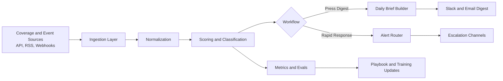

# Comms AI Portfolio: Press Digest + Rapid Response

A public, reproducible portfolio for **AI Solutions Architect (Communications)** work. This repo demonstrates two production-style workflows:

- `Press Digest`: Monitors coverage, filters for relevance, tags topic/sentiment, and outputs a Slack-ready morning briefing.
- `Rapid Response`: Scores incoming events for priority and routes alerts to the right stakeholders with escalation guidance.

Both pipelines use mock/synthetic data and no secrets, so the repository is safe to share publicly.

## Why This Exists

This project is built to show evidence across four operating pillars:

- **Discover**: Identify high-friction comms workflows and map requirements.
- **Build**: Implement reliable automation with clear failure modes.
- **Train**: Provide docs and simple runbooks for non-technical collaborators.
- **Catalogue**: Record KPI hypotheses, evals, and rollout lessons for reuse.

## Repo Structure

```text
.
├── data/                         # Mock data for local demos
├── docs/                         # Architecture and training docs
├── evals/                        # Evaluation plans and scoring rubrics
├── playbook/                     # Reusable comms automation playbook
├── scripts/                      # Runnable entrypoints
├── src/comms_ai_portfolio/       # Core logic
├── tests/                        # Unit tests
└── outputs/                      # Generated outputs (gitignored except .gitkeep)
```

## Architecture



## Quickstart

### 1) Setup

```bash
python3 -m venv .venv
source .venv/bin/activate
pip install -r requirements.txt
```

### 2) Run Press Digest

```bash
python scripts/run_press_digest.py
cat outputs/press_digest.md
```

### 3) Run Rapid Response

```bash
python scripts/run_rapid_response.py
cat outputs/rapid_response_alerts.json
```

### 4) Run Tests

```bash
python -m unittest discover -s tests -p 'test_*.py'
```

## Sample Outputs

`Press Digest` output format:

- date header
- prioritized clips
- topic + sentiment tags
- short rationale for inclusion

`Rapid Response` output format:

- priority score and tier
- recommended owners
- escalation path
- response deadline by severity

## Public Safety Guardrails

- No credentials or API keys in source.
- `.env.example` included for local config.
- Mock/synthetic data only.
- Do not ingest sources that violate terms of service.

## Next Production Steps

- Replace heuristic scoring with Claude + evaluation harness.
- Add human-in-the-loop approval UI for high-priority alerts.
- Integrate Slack + internal tooling adapters.
- Track live KPIs (throughput, MTTR for responses, false-positive rate).

## License

MIT (see `LICENSE`).
